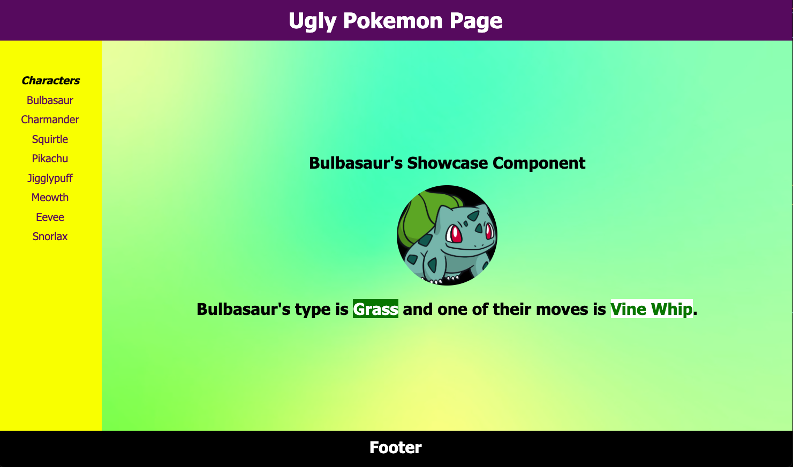

# Pokemon Layout

## Getting started

- fork and clone this repo

- `npm install`

- `npm run dev` to run the app on port 3000

Try to approximate the layout above in ReactJS using a Header, Aside, Main & Footer components. Maybe CSS Grid? It does not need to be exact. Just as close an approximation as you can get.

In the Aside component create a list using `.map` if you can. If not then hard code the list.

You may put all of your CSS in the App.css for simplicity or if you like, you can create connected CSS files that coordinate with each component.

Images for the Main component background and Bulbasaur image are located in the `assets` folder.

Good Luck!
